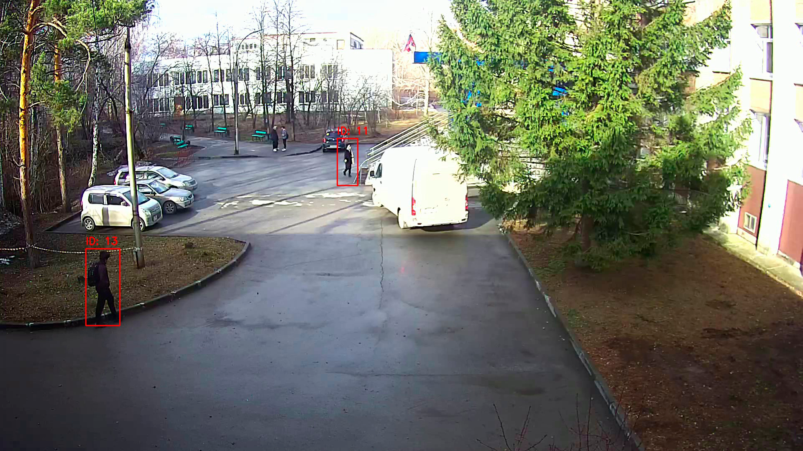
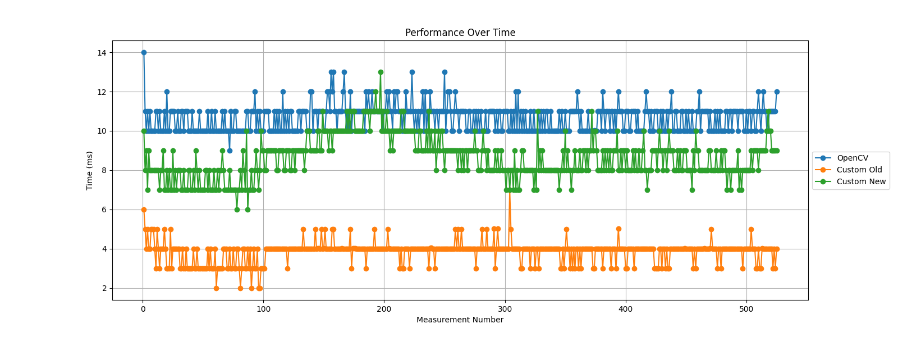

# Детектор движения в кадре

## Описание проекта
Данный проект представляет собой систему детекции движения на видео с использованием алгоритма вычитания фона. Система способна:  

 - Автоматически строить модель фона  
 - Выделять движущиеся объекты  
 - Фильтровать ложные срабатывания  
 - Отслеживать обнаруженные объекты

## Технологии
 - Python
 - OpenCV
 - NumPy

## Установка
 1. Клонируйте репозиторий  
    ```
    git clone https://github.com/KamenevIvan/MotionDetection.git
    cd MotionDetection
    ```
 2. Установите зависимости  
    ```
    pip install -r requirements.txt
    ```
 4. Настройте параметры в `./src/settings.py`
 5. Запустите основной скрипт
    `python ./src/main.py`


## Основные модули
 1. `main.py` - Главный исполняемый файл  
    Назначение: 
    Координация работы всех компонентов системы. Содержит основной цикл обработки видео.
    
 2. `detection_processing.py` - Обработка детекций  
    Назначение: 
    Анализ и постобработка обнаруженных объектов движения.

 3. `image_processing.py` - Обработка изображений  
    Назначение: 
    Базовые операции компьютерного зрения.

 4. `detector_IO.py` - Ввод/вывод данных  
    Назначение: 
    Работа с источниками видео и сохранение результатов.

 5. `settings.py` - Конфигурация системы  
    Назначение: 
    Централизованное хранение параметров.

## Дополнительные скрипты
 1. `VideoBuilder` - скрипт для сборки видеофайла из отдельных кадров.
 2. `TimeGraphBuilder` - скрипт построения графиков для анализа времени работы отдельных функций.
 3. `Motmetrics` - Скрипт для сравнения результатов работы детектора с ground truth

## Пример работы детектора


## Сравнение времени работы разных вычитателей фона
 - `OpenCV` - Время работы вычитателя MOG2 из библиотеки OpenCV  
 - `Custom Old` - Первая версия самописного вычитателя. Неустойчив к шуму, но очень быстро работает.
 - `Custom New` - Последняя версия самописного вычитателя. Немного быстрее и устойчивее к шуму, чем у OpenCV.

